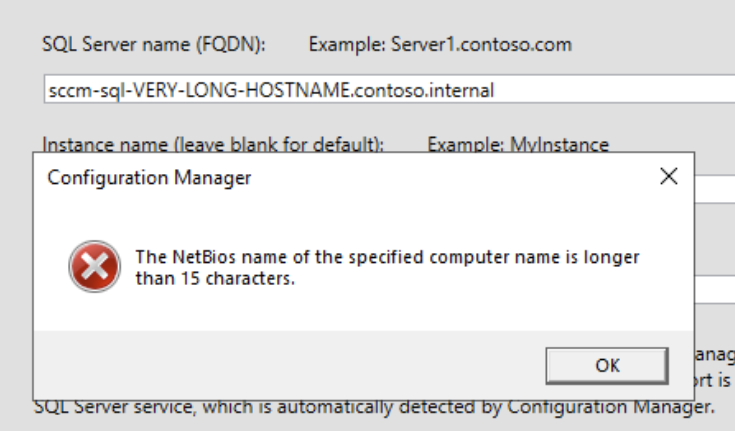

# SCCM Collection for Ansible and [Ludus](https://ludus.cloud)

This collection includes Ansible roles to install and configure SCCM. For a good example of the collection's usage, see the `sccm-range-config.yml`.

Roles included in this collection:

  - `synzack.ludus_sccm.disable_firewall`
  - `synzack.ludus_sccm.enable_webdav`
  - `synzack.ludus_sccm.install_adcs`
  - `synzack.ludus_sccm.ludus_sccm_distro`
  - `synzack.ludus_sccm.ludus_sccm_mgmt`
  - `synzack.ludus_sccm.ludus_sccm_siteserver`
  - `synzack.ludus_sccm.ludus_sccm_sql`

## Installation in [Ludus](ludus.cloud)

Install via Ansible Galaxy:

```
ludus ansible collection add synzack.ludus_sccm
```

### Role Requirements

None

## Notes
* Due to unknown issues with SCCM, *.local* domain suffixes will not work properly. We recommend using something else such as *.domain* or *.lab* for your domain suffix
* If you wish to add client push to the DC, you will need to add Remote Scheduled Tasks Management firewall rules or use the *disable_firewall* role
* At this time, all 4 site server roles are needed to deploy SCCM, there is no standalone option yet

## Usage
> [!WARNING]
> All SCCM VM hostnames MUST be <= 15 characters

<p align="center"></p>

Here's an example Ludus configuration that uses this module to set up a full SCCM deployment, along with default values:

```yaml
ludus:
  - vm_name: "{{ range_id }}-DC01"
    hostname: "DC01"
    template: win2022-server-x64-template
    vlan: 10
    ip_last_octet: 10
    ram_gb: 4
    ram_min_gb: 1
    cpus: 2
    windows:
      sysprep: true
    domain:
      fqdn: ludus.domain
      role: primary-dc
    roles:
      - synzack.ludus_sccm.install_adcs
      - synzack.ludus_sccm.disable_firewall

  - vm_name: "{{ range_id }}-Workstation"
    hostname: "Workstation"
    template: win11-22h2-x64-enterprise-template
    vlan: 10
    ip_last_octet: 11
    ram_gb: 4
    ram_min_gb: 1
    cpus: 2
    windows:
      sysprep: true
    domain:
      fqdn: ludus.domain
      role: member
    roles:
      - synzack.ludus_sccm.disable_firewall

  - vm_name: "{{ range_id }}-sccm-distro"
    hostname: "sccm-distro"
    template: win2022-server-x64-template
    vlan: 10
    ip_last_octet: 12
    ram_gb: 4
    ram_min_gb: 1
    cpus: 4
    windows:
      sysprep: true
    domain:
      fqdn: ludus.domain
      role: member
    roles:
      - synzack.ludus_sccm.ludus_sccm_distro
    role_vars:
      ludus_sccm_site_server_hostname: 'sccm-sitesrv' 

  - vm_name: "{{ range_id }}-sccm-sql"
    hostname: "sccm-sql"
    template: win2022-server-x64-template
    vlan: 10
    ip_last_octet: 13
    ram_gb: 4
    ram_min_gb: 1
    cpus: 4
    windows:
      sysprep: true
    domain:
      fqdn: ludus.domain
      role: member
    roles:
      - synzack.ludus_sccm.ludus_sccm_sql
    role_vars:
      ludus_sccm_site_server_hostname: 'sccm-sitesrv'    
      ludus_sccm_sql_server_hostname: 'sccm-sql'         
      ludus_sccm_sql_svc_account_username: 'sqlsccmsvc'  
      ludus_sccm_sql_svc_account_password: 'Password123' 

  - vm_name: "{{ range_id }}-sccm-mgmt"
    hostname: "sccm-mgmt"
    template: win2022-server-x64-template
    vlan: 10
    ip_last_octet: 14
    ram_gb: 4
    ram_min_gb: 1
    cpus: 4
    windows:
      sysprep: true
    domain:
      fqdn: ludus.domain
      role: member
    roles:
      - synzack.ludus_sccm.ludus_sccm_mgmt
    role_vars:
      ludus_sccm_site_server_hostname: "sccm-sitesrv" 

  - vm_name: "{{ range_id }}-sccm-sitesrv"
    hostname: "sccm-sitesrv" 
    template: win2022-server-x64-template
    vlan: 10
    ip_last_octet: 15
    ram_gb: 4
    ram_min_gb: 1
    cpus: 4
    windows:
      sysprep: true
    domain:
      fqdn: ludus.domain
      role: member
    roles:
      - synzack.ludus_sccm.ludus_sccm_siteserver
      - synzack.ludus_sccm.enable_webdav
    role_vars:
      ludus_sccm_sitecode: 123           
      ludus_sccm_sitename: Primary Site  
      ludus_sccm_site_server_hostname: 'sccm-sitesrv'  
      ludus_sccm_distro_server_hostname: 'sccm-distro' 
      ludus_sccm_mgmt_server_hostname: 'sccm-mgmt'     
      ludus_sccm_sql_server_hostname: 'sccm-sql'       
      # --------------------------NAA Account-------------------------------------------------
      ludus_sccm_configure_naa: true
      ludus_sccm_naa_username: 'sccm_naa'
      ludus_sccm_naa_password: 'Password123'
      # --------------------------Client Push Account-----------------------------------------
      ludus_sccm_configure_client_push: true
      ludus_sccm_client_push_username: 'sccm_push'
      ludus_sccm_client_push_password: 'Password123'
      ludus_sccm_enable_automatic_client_push_installation: true
      ludus_sccm_enable_system_type_configuration_manager: true
      ludus_sccm_enable_system_type_server: true
      ludus_sccm_enable_system_type_workstation: true
      ludus_sccm_install_client_to_domain_controller: false  #"True" Requires Remote Scheduled Tasks Managmenet firewall rules enabled (or no firewall)
      ludus_sccm_allow_NTLM_fallback: true
      # ---------------------------Discovery Methods------------------------------------------
      ludus_sccm_enable_active_directory_forest_discovery: true
      ludus_sccm_enable_active_directory_boundary_creation: true
      ludus_sccm_enable_subnet_boundary_creation: true
      ludus_sccm_enable_active_directory_group_discovery: true
      ludus_sccm_enable_active_directory_system_discovery: true
      ludus_sccm_enable_active_directory_user_discovery: true
      # ----------------------------------PXE-------------------------------------------------
      ludus_sccm_enable_pxe: true
      ludus_enable_pxe_password: yes
      ludus_pxe_password: 'Password123'
      ludus_domain_join_account: domainadmin
      ludus_domain_join_password: 'password'
```

Then set the config and deploy it

```
ludus range config set -f sccm-range-config.yml
ludus range deploy
```

## Building the Collection from Source

```
git clone https://github.com/Synzack/ludus_sccm
ansible-galaxy collection build
```

### Ludus Install of manually built collection

via Ludus ansible collection
```
python3 -m http.server 80
ludus ansible collection add http://<network ip>/synzack-ludus_sccm-1.0.0.tar.gz
```

via scp
```
export LUDUS_USER_NANE=$(ludus user list --json | jq -r '.[].proxmoxUsername')
ssh root@<ludus-host> "mkdir -r /opt/ludus/users/$LUDUS_USER_NANE/.ansible/collections/ansible_collections/synzack/ludus_sccm"
rsync -av --exclude .git/ ./ root@<ludus-host>:/opt/ludus/users/$LUDUS_USER_NANE/.ansible/collections/ansible_collections/synzack/ludus_sccm/
```

## License

GPLv3

## Author

This collection was created by [Zach Stein](https://twitter.com/synzack21) and [Erik Hunstad](https://github.com/kernel-sanders), for [Ludus](https://ludus.cloud).
